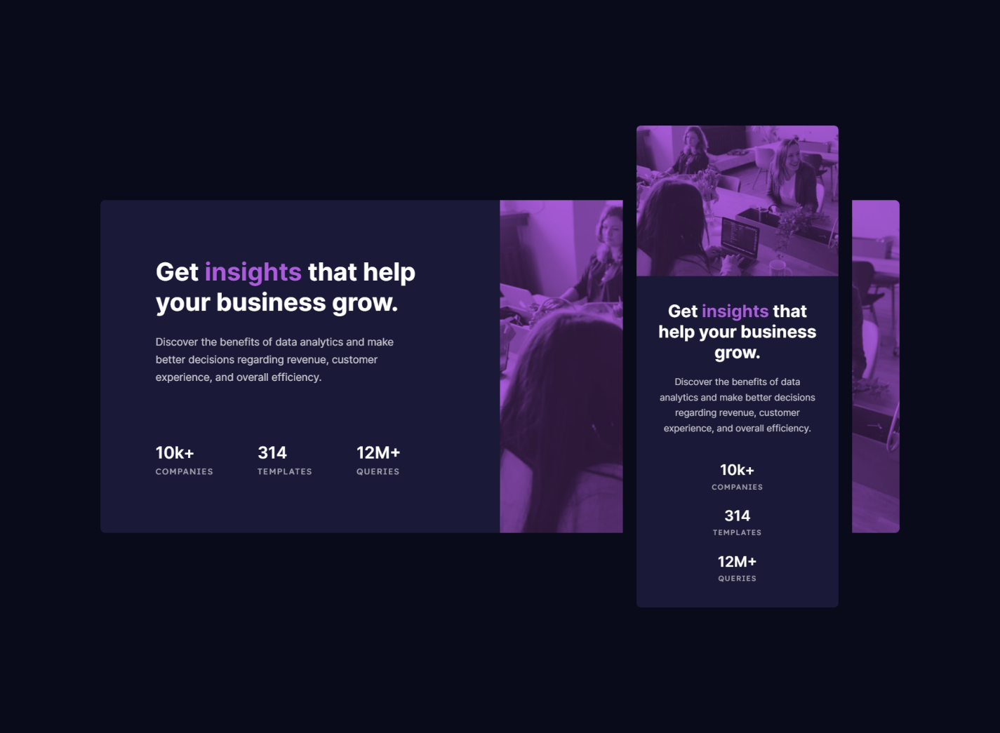

# Frontend Mentor - Stats preview card component solution

This is a solution to the [Stats preview card component challenge on Frontend Mentor](https://www.frontendmentor.io/challenges/stats-preview-card-component-8JqbgoU62). Frontend Mentor challenges help you improve your coding skills by building realistic projects.

## Overview

### The challenge

Users should be able to:

- View the optimal layout depending on their device's screen size

### Screenshot



### Links

- Live Site URL: [https://cholis04.github.io/stats-preview-card-component-main/](https://cholis04.github.io/stats-preview-card-component-main/)

## My process

### Built with

- Picture Tag HTML
- Mobile-first workflow
- CSS custom properties
- CSS Grid
- Flexbox
- Mix Blend Mode
- Media Queries

### What I learned

i am happy to know the html tag which can be used to display the image according to the screen resolution. and this reduces writes in media queries on css. Here's the code :

```html
<picture class="card-thumbnail">
  <source
    media="(min-width:580px)"
    srcset="./images/image-header-desktop.jpg"
  />
  
</picture>
```

I tried the css flex wrap property, this makes me only write media queries on the parent element instead of having to write the Order property on each child element to swap element order. Here's the code:

```css
.preview-card {
  display: flex;
  flex-wrap: wrap-reverse;
}

@media only screen and (min-width: 780px) {
  .preview-card {
    flex-wrap: nowrap;
  }
}
```

I want to try to create an overlay without adding elements in the html. by adding a background color to the parent element, then mix-blend-mode on the img element inside. And reduce the opacity to make it look the same as the design. I think it works pretty well. what do you think? . Here's the code:

```css
.card-thumbnail {
  background-color: var(--accent);
}
.card-thumbnail > img {
  mix-blend-mode: multiply;
  filter: opacity(75%);
}
```

## Author

- Website - [https://cholis04.github.io](https://cholis04.github.io)
- Frontend Mentor - [@cholis04](https://www.frontendmentor.io/profile/cholis04)
- Dribbble - [cholis04](https://dribbble.com/cholis04)
- Instagram - [@cholis04](https://instagram.com/cholis04)
- Codepen - [cholis04](https://codepen.io/cholis04)
